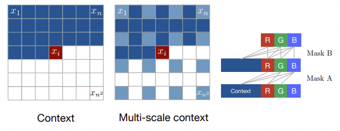

# Generative Models with β-VAE, VQ-VAE, and PixelCNN

This repository provides a comprehensive PyTorch implementation combining **β-VAE**, **VQ-VAE**, and **PixelCNN** for generative modeling.  
It includes training and sampling pipelines for β-VAE and VQ-VAE, and integrates PixelCNN as an autoregressive prior over VQ-VAE discrete latent spaces, enabling high-quality image generation and conditional sampling.

## Features

- Implementation of β-VAE with configurable β for disentangled representation learning.
- Implementation of VQ-VAE with vector quantization for discrete latent spaces.
- Integration of PixelCNN as a prior over VQ-VAE latent codes.
- Modular training and evaluation scripts.
- Easy to extend to custom datasets.

## Project Structure

```
Betavae_Vqvae_PixelCnn/
├── LICENSE
├── README.md
├── beta_vae.py               # β-VAE model definition
├── vq_vae.py                 # VQ-VAE model definition
├── pixel_cnn.py              # PixelCNN model definition
├── dataset.py                # Dataset loading and preprocessing
├── train.py                  # Main training script
├── evaluate.py               # Evaluation script for VAEs
├── evaluate_pixel_cnn.py     # Evaluation script for PixelCNN
├── utils.py                  # Utility functions
├── samples					  # Sample figures
```

## Installation

> Because I wanted to use the GPU version of PyTorch, I did not provide a `requirement.txt file`. Instead, I found the corresponding version online and downloaded it.

1. Create new environment

```
conda create -n vae python=3.10 -y
```

2. Activate new environment

```
conda activate vae
```

3. Install pytorch

> Check your cuda version first. https://pytorch.org/get-started/previous-versions/

```
pip install torch==2.6.0 torchvision==0.21.0 torchaudio==2.6.0 --index-url https://download.pytorch.org/whl/cu124
```

4. Install other libraries

```
pip install tqdm matplotlib Pillow
```

## Usage

### Train β-VAE: Configure hyperparameters and execute `train.py`

```python
    latent_dim = 256  # 128
    betaVAE_model = BetaVAE(in_channels=3, latent_dim=latent_dim, gamma=10, max_capacity=25, Capacity_max_iter=10000, loss_type="B")
    save_path = 'logs/beta_VAE.pth'

    train(img_dir, batch_size, epochs, lr, patience, save_path, img_size, subset_prop,
          val_prop, betaVAE_model)
```

### Train VQ-VAE: Configure hyperparameters and execute `train.py`

```python
    vqVAE_model = VQVAE(
        in_channels=3,
        embedding_dim=64,
        num_embeddings=512,
        img_size=64,
        beta=0.25
    )

    save_path = 'logs/vq_VAE.pth'

    train(img_dir, batch_size, epochs, lr, patience, save_path, img_size, subset_prop,
          val_prop, vqVAE_model)
```

### Train PixelCNN as a prior (after VQ-VAE training)： Configure hyperparameters and execute `pixel_cnn.py`

```python
prior_model = PixelCNNPrior(num_embeddings=512, hidden_dim=64, num_layers=9)

train_prior(vqvae_model, prior_model, dataset, batch_size=64, epochs=200, lr=1e-3, device=device)
```

## Evaluate

- `VAE model`: python evaluate.py
- `Pixel CNN prior model`: python evaluate_pixel_cnn.py

## Results

### β-VAE Reconstruction


### β-VAE Random Samples


### VQ-VAE Reconstruction


### **Integrating PixelCNN with VQ‑VAE**


## DataSet

The default dataset is CelebA.

Source: https://drive.google.com/file/d/1m8-EBPgi5MRubrm6iQjafK2QMHDBMSfJ/view

# Overview of Theoretical Details


> Jim Wang | Medium

# Beta-VAE 

## Introduction / 简介

The implementation mainly refers to the paper:  
实现主要参考论文：

**“Understanding disentangling in β-VAE”**  
（Christopher P. Burgess, Irina Higgins 等，ICLR 2018）  

[https://openreview.net/forum?id=Sy2fzU9gl](https://openreview.net/forum?id=Sy2fzU9gl)  

And the following open source implementation:  
并参考以下开源实现：

[AntixK / PyTorch‑VAE](https://github.com/AntixK/PyTorch-VAE/blob/master/models/beta_vae.py)

## Principle / 原理

“We want to develop an unsupervised deep generative model that, using samples from X only, can learn the joint distribution of the data and a set of generative latent factors z.” — Burgess et al., 2018  
“我们希望开发一种无监督的深度生成模型，仅通过来自 X 的样本，就能够学习数据及一组潜在生成因子 z 的联合分布。” — Burgess 等, 2018

The standard VAE optimizes the evidence lower bound (ELBO):  
标准 VAE 优化证据下界（ELBO）：

$$
\max_{\theta,\phi} \; \mathbb{E}_{q_\phi(z|x)} [\log p_\theta(x|z)] - D_{KL}(q_\phi(z|x)\|p(z))
$$

In β-VAE, the KL term is weighted by β to encourage disentanglement:  
在 β‑VAE 中，KL 项由 β 加权以鼓励解耦：

$$
\mathcal{L} = \text{Reconstruction Loss} + \beta \cdot D_{KL}(q_\phi(z|x)\|p(z))
$$

Burgess et al. proposed **capacity control**:  
然而 Burgess 等提出了 **容量控制** 方法：

$$
\mathcal{L} = \text{Reconstruction Loss} + \gamma \cdot | D_{KL}(q_\phi(z|x)\|p(z)) - C |
$$

And gradually increase \( C \) to control capacity, so KL divergence approaches the target.  
通过逐渐增加 \( C \) 来控制容量，使 KL 散度逐步接近目标。

## Implementation Details / 实现细节

- **Encoder / Decoder**: convolutional encoder and transposed convolutional decoder with BatchNorm and LeakyReLU.  
- **Latent Space**: fully connected layers outputting \( $\mu$ \) and \( $\log\sigma^2$ \).  
- **Reparameterization**: sampling latent \( z \) from \( $\mu$, $\sigma$ \).  
- **Loss**: MSE reconstruction loss + capacity-controlled KL divergence.

## Code Structure / 代码结构

Implemented in `models/beta_vae.py` as the **BetaVAE** class.  
核心由 **Encoder**、**Decoder**、**Reparameterization** 和 **Loss Function** 四部分组成。

### BetaVAE Class

```python
class BetaVAE(nn.Module):
    def __init__(self, in_channels, latent_dim, hidden_dims=None, 
                 beta=10, gamma=10., max_capacity=25,
                 Capacity_max_iter=10000, loss_type='B'):
        ...
```

### Encoder

```
        modules = []
        if hidden_dims is None:
            hidden_dims = [32, 64, 128, 256, 512]

        # Build Encoder
        for h_dim in hidden_dims:
            modules.append(
                nn.Sequential(
                    nn.Conv2d(in_channels, out_channels=h_dim,
                              kernel_size= 3, stride= 2, padding  = 1),
                    nn.BatchNorm2d(h_dim),
                    nn.LeakyReLU())
            )
            in_channels = h_dim

        self.encoder = nn.Sequential(*modules)
        self.fc_mu = nn.Linear(hidden_dims[-1]*4, latent_dim)
        self.fc_var = nn.Linear(hidden_dims[-1]*4, latent_dim)
```


The encoder downsamples a 64×64 input through five stride‑2 convolutions, ending with a 2×2 feature map.  
编码器对 64×64 的输入经过五次 stride=2 卷积，最后得到 2×2 的特征图。  

The last layer has `hidden_dims[-1]` channels, so the flattened size is `hidden_dims[-1] × (2×2)`.  
最后一层有 `hidden_dims[-1]` 个通道，所以展平后的大小是 `hidden_dims[-1] × (2×2)`。

> `latent_dim` is the **dimension** of the latent space, that is, the number of dimensions into which the encoder ultimately compresses the input image as a vector.
>
> `latent_dim` 就是潜在空间（latent space）的**维度**，也就是编码器最终要把输入图像压缩成一个多少维的向量。

**Finally get mu and log var through fully connection layers.**

### Decoder

`ConvTranspose2d`: transposed convolution (deconvolution) to upsample (double spatial size).  
  转置卷积用于上采样（空间尺寸扩大一倍）。

Restore the image to its original size (such as 64×64) layer by layer through **transposed convolution (ConvTranspose2d)**.

逐层通过 **转置卷积（ConvTranspose2d）** 恢复成原始图像的尺寸（比如 64×64）

### reparameterize

This function samples a latent vector `z` from a Gaussian distribution parameterized by `mu` and `logvar`.  
该函数从由 `mu` 和 `logvar` 参数化的高斯分布中采样潜在向量 `z`。

It uses the reparameterization trick to allow backpropagation through the sampling process by expressing `z` as:  
通过重参数化技巧，`z` 被表示为：  
$$
z = \mu + \sigma \times \epsilon
$$
where \( $\epsilon$ $\sim$ $\mathcal{N}(0, I)$ \), enabling gradient flow.  
其中 \( $\epsilon \sim \mathcal{N}(0, I)$ \)，使梯度能够传播。

This ensures the model can be trained end-to-end with stochastic sampling.  
保证模型可以在有随机采样的情况下端到端训练

### **Loss Function Explanation**  

- The function calculates the total loss for training the β-VAE.  
  该函数计算训练 β-VAE 的总损失。

- **Inputs:**  
  - `recons`: reconstructed output from the decoder  
  - `input`: original input image  
  - `mu`, `log_var`: mean and log variance of latent distribution  
  - `kld_weight`: weight scaling KL divergence based on minibatch size  
    输入包括重建图像、原始图像、潜变量分布的均值和对数方差，以及用于调整 KL 散度的权重。

- **Reconstruction loss:**  
  Uses Mean Squared Error (MSE) between reconstruction and input.  
  重建误差用重建图像和输入图像的均方误差（MSE）。

- **KL divergence loss:**  
  Measures difference between latent distribution and standard normal prior.  
  KL 散度衡量潜在分布与标准正态分布的差异。

- **Loss types:**  
  - **H-type:**  
    Loss = Reconstruction + β × kld_weight × KL divergence  
    标准 β-VAE 损失，加权 KL 项。  
  - **B-type (capacity control):**  
    Gradually increases a capacity term `C` over iterations, encouraging KL divergence to approach `C`.  
    Loss = Reconstruction + γ × kld_weight × |KL divergence - C|  
    通过逐渐增加容量 `C` 控制 KL 散度。

- Returns a dictionary with total loss, reconstruction loss, and KL divergence for logging and optimization.  
  返回总损失、重建损失和 KL 散度，方便训练时记录和优化。

> **kld_weight**  
> KL散度权重
>
> - It adjusts the contribution of the KL divergence term in the loss based on the minibatch size relative to the entire dataset.  
>
> - 它根据小批量样本数量相对于整个数据集的比例，调整KL散度项在损失中的权重。
>
> - This helps to properly scale the KL term when training with minibatches instead of the full dataset.  
>
> - 这样可以在使用小批量训练时，合理缩放KL散度的影响，保证训练稳定。
>
>   > ```
>   > imgs.size(0)/len(train_loader.dataset)
>   > ```

### Generate

The `sample` function generates new images by sampling random latent vectors from a standard normal distribution and decoding them.  
`sample` 函数通过从标准正态分布随机采样潜变量并解码，生成新的图像。

The `generate` function reconstructs input images by encoding them into latent variables (`mu` and `log_var`), sampling from this distribution, and decoding the result.  
`generate` 函数通过编码输入图像得到潜变量（均值和方差），采样后解码，完成图像重建。


# VQ-VAE

## Reference

https://arxiv.org/abs/1711.00937

> Our contributions can thus be summarised as:
>
> *•* Introducing the VQ-VAE model, which is simple, uses discrete latents, does not suffer from “posterior collapse” and has no variance issues.
>
> *•* We show that a discrete latent model (VQ-VAE) perform as well as its continuous model counterparts in log-likelihood.
>
> *•* When paired with a powerful prior, our samples are coherent and high quality on a wide variety of applications such as speech and video generation.
>
> *•* We show evidence of learning language through raw speech, without any supervision, and show applications of unsupervised speaker conversion.

## Introduction to VQ-VAE

Vector Quantized Variational Autoencoder (VQ-VAE) is a generative model that learns discrete latent representations.  
VQ-VAE 是一种生成模型，能够学习离散的潜在表示。

Unlike traditional VAEs which use continuous latent variables, VQ-VAE quantizes the encoder outputs to discrete codebook entries.  
与传统VAE使用连续潜变量不同，VQ-VAE将编码器输出量化为离散的码本向量。

This discrete latent space often leads to better representations for tasks like image generation and compression.  
离散潜空间通常能为图像生成和压缩等任务提供更好的表示。

The model consists of three parts: encoder, vector quantizer, and decoder.  
模型包含三个部分：编码器、向量量化器和解码器。

The **encoder** maps input $x$ to a continuous latent vector $z_e(x)$.  
编码器将输入 $x$ 映射到连续潜向量 $z_e(x)$。

The **vector quantizer** maps $z_e(x)$ to the nearest codebook vector $e_k$, producing discrete latent $z_q(x)$.  
量化器将 $z_e(x)$ 映射到码本中最近的向量 $e_k$，得到离散潜变量 $z_q(x)$。

The **decoder** reconstructs $x$ from $z_q(x)$.  
解码器根据离散潜变量 $z_q(x)$ 重构输入 $x$。

During training, the model optimizes reconstruction loss plus vector quantization losses to align encoder outputs and embeddings.  
训练时，模型优化重构损失和量化损失，使编码器输出和码本向量相互靠近。

This enables learning of powerful discrete latent codes useful in many downstream tasks.  
这样能学习强大的离散潜编码，对多种下游任务非常有用。

## Vector Quantizer in VQ-VAE: Theory and Loss Explanation

The Vector Quantizer module in VQ-VAE transforms continuous latent vectors into discrete codebook embeddings.  
VQ-VAE中的向量量化器模块将连续的隐向量映射到一个离散的码本中。

Given an encoder output \($z_e(x)$\), the quantizer finds the nearest embedding vector \($e_k$\) in a fixed-size codebook (${e_1, e_2, ..., e_K)}$ by minimizing Euclidean distance:  
给定编码器输出 \($z_e(x)$\)，量化器通过欧氏距离找到码本 \($\{e_1, e_2, ..., e_K\}$\) 中最接近的向量 \($e_k$\)，公式为：
$$
z_q(x) = e_{k^*}, \quad k^* = \arg\min_k \| z_e(x) - e_k \|^2
$$

This discretizes the latent space and enables the model to learn discrete representations.  
这个步骤实现了潜空间的离散化，使模型能学习离散的表示。

The loss used to train the model consists of three parts: reconstruction loss, embedding loss, and commitment loss.  
训练损失由三部分组成：重构损失、嵌入损失和承诺损失。

Reconstruction loss encourages the decoder to reconstruct input from the quantized latent vector:  
重构损失促使解码器用量化后的潜向量重构输入：

$$
\log p(x | z_q(x))
$$

Embedding loss updates the codebook vectors to be close to encoder outputs (stop gradient for encoder):  
嵌入损失使码本向量靠近编码器输出（对编码器停止梯度传递）：
$$
\| \mathrm{sg}[z_e(x)] - e \|^2
$$

Commitment loss encourages encoder outputs to stay close to chosen embeddings (stop gradient for embeddings), controlled by \(\beta\):  
承诺损失使编码器输出稳定接近所选码本向量（对码本停止梯度传递），\($\beta$\) 控制权重：
$$
\beta \| z_e(x) - \mathrm{sg}[e] \|^2
$$

Here, \($\mathrm{sg}[\cdot]$\) denotes stop-gradient operation, which prevents gradient flow through its argument.  
其中，\($\mathrm{sg}[\cdot]$\) 表示停止梯度操作，不对括号内变量传递梯度。

The quantization step is non-differentiable, which blocks gradients during backpropagation.  
量化步骤不可微，阻断反向传播梯度。

VQ-VAE solves this by using a straight-through estimator, passing gradients from quantized vector to encoder output:  
VQ-VAE用直通估计器解决该问题，将量化向量的梯度直接传给编码器输出：

$$
z_q = z_e + \mathrm{sg}[z_q - z_e]
$$

This trick enables end-to-end training despite discrete quantization.  
该技巧使得即使有离散操作，模型仍能端到端训练。

# PixelCNN



**Reference:**

https://github.com/jzbontar/pixelcnn-pytorch

https://arxiv.org/abs/1601.06759

**PixelCNN** is an Autoregressive generative model used to model the joint distribution of images.

It generates images by predicting pixel by pixel, and the distribution of each pixel depends on the pixel already generated in the upper left corner of it.

**PixelCNN** 是一种自回归（Autoregressive）生成模型，用于建模图像的联合分布。  
它通过逐像素地预测来生成图像，每一个像素的分布依赖于它左上方已经生成的像素。

**PixelCNN uses convolutional neural networks to model the conditional probability of each pixel. To ensure causality during generation, a mask is applied to the convolution kernels:**
 PixelCNN 通过 **卷积神经网络** 来建模每个像素的条件概率。为了在生成时保证因果性，需要对卷积核进行 **Mask** 操作：

**– MaskedConv2d Type A:** Used in the first layer, the current pixel is not allowed to see itself.
 **– MaskedConv2d A 型**：用于第一层，当前像素不能看到自身。

**– MaskedConv2d Type B:** Used in later layers, the current pixel is allowed to see itself because the input now comes from previous feature maps instead of raw pixels.
 **– MaskedConv2d B 型**：用于后续层，允许当前像素看到自身（输入来自上一层的特征）。
